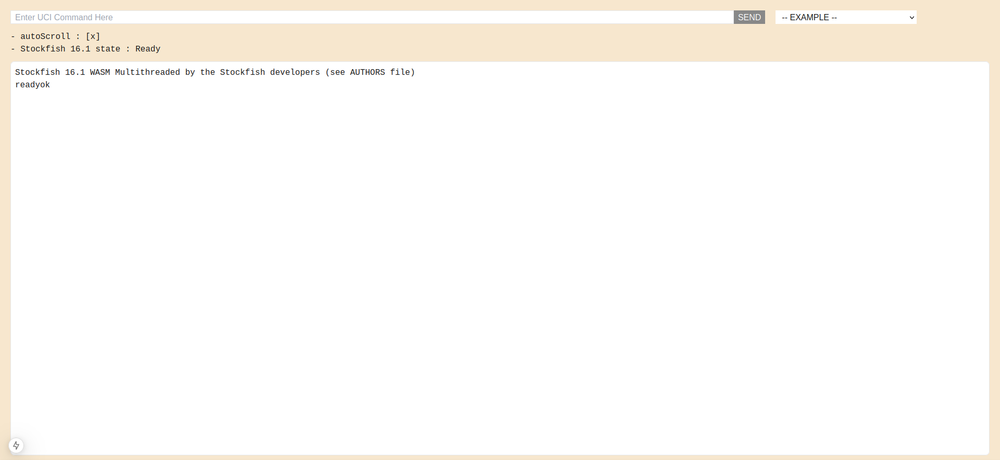

# Stockfish 16.1 Terminal
So this is a Next.js project prepared for WebAssembly port of [Stockfish](https://github.com/official-stockfish/Stockfish) with the latest version of 16.1. You can find the original project [here](https://github.com/nmrugg/stockfish.js).

[](https://stockfish161-terminal.vercel.app/)

---

### Setting up the project
Run the following bash commands in the choice of your directory
```
// clone the repository
git clone https://github.com/Sandstorm831/Stockfish_16.1_terminal.git

// enter the project
cd Stockfish_16.1_terminal/

// install the packages
npm install

// run the development server
npm run dev
```
Open [http://localhost:3000](http://localhost:3000) with your browser to see the result.
### Project structure
```
Stockfish_16.1_terminal
 ┣ .next
 ┣ app
 ┃   ┣ favicon.ico
 ┃   ┣ globals.css
 ┃   ┣ layout.tsx
 ┃   ┗ page.tsx                                 # Implementation of the root page and 
 ┃                                                initialization of the engine
 ┣ public
 ┃   ┣ lib                                      # folder containing the stockfish WebAssembly
 ┃   ┃ ┃                                          and glue code
 ┃   ┃ ┣ stockfish-16.1.js                      # Glue code for interacting with .WASM file
 ┃   ┃ ┗ stockfish-16.1.wasm                    # Stockfish WebAssembly
 ┃   ┃
 ┃   ┣ file.svg
 ┃   ┣ globe.svg
 ┃   ┣ next.svg
 ┃   ┣ vercel.svg
 ┃   ┗ window.svg
 ┃
 ┣ .gitignore
 ┣ README.md
 ┣ eslint.config.mjs
 ┣ next-env.d.ts
 ┣ next.config.ts                               # Essential headers allowance for working
 ┃                                                with Web-Workers
 ┣ package-lock.json
 ┣ package.json
 ┣ postcss.config.mjs
 ┣ tailwind.config.ts
 ┗ tsconfig.json
```

### Header allowances
The engine will run in browsers with proper CORS headers applied. The following HTTP headers are required on top level response
```
Cross-Origin-Embedder-Policy: require-corp
Cross-Origin-Opener-Policy: same-origin
```
and following on included files
```
Cross-Origin-Embedder-Policy: require-corp
```
If top level headers are not configured properly, the `wasmThreadsSupported()` function as defined below will return `false`. If headers on included files are not configured correctly, something like `pthread sent an error! undefined:undefined: undefined` maybe logged to the console. You can read more about these headers [here](https://web.dev/articles/cross-origin-isolation-guide)

### WebAssembly Threads Support
```
function wasmThreadsSupported() {
  // WebAssembly 1.0
  const source = Uint8Array.of(0x0, 0x61, 0x73, 0x6d, 0x01, 0x00, 0x00, 0x00);
  if (
    typeof WebAssembly !== "object" ||
    typeof WebAssembly.validate !== "function"
  )
    return false;
  if (!WebAssembly.validate(source)) return false;

  // SharedArrayBuffer
  if (typeof SharedArrayBuffer !== "function") return false;

  // Atomics
  if (typeof Atomics !== "object") return false;

  // Shared memory
  const mem = new WebAssembly.Memory({ shared: true, initial: 8, maximum: 16 });
  if (!(mem.buffer instanceof SharedArrayBuffer)) return false;

  // Structured cloning
  try {
    // You have to make sure nobody cares about these messages!
    window.postMessage(mem, "*");
  } catch (e) {
    return false;
  }

  // Growable shared memory (optional)
  try {
    mem.grow(8);
  } catch (e) {
    return false;
  }

  return true;
}
```

### License
[Stockfish team](https://github.com/official-stockfish/Stockfish) released the engine under GPL3 license
